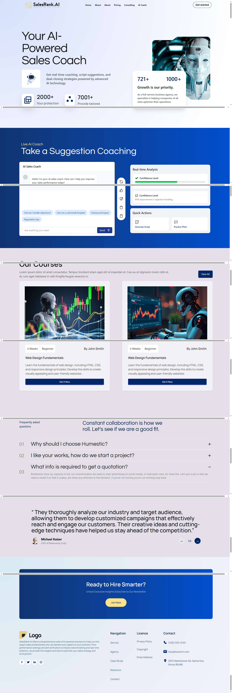
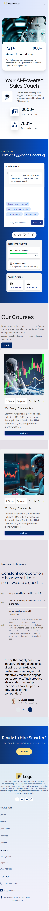

# AI-Powered Web Application Landing Page 🚀

A modern, responsive landing page built using **HTML**, **Tailwind CSS**, **JavaScript**, and **DaisyUI**. This project is designed for showcasing an AI-powered web application, featuring smooth layout, interactivity, and mobile-first design.

## 🔗 Live Site

👉 [View Live Demo](https://ai-powered-landing-page.netlify.app/)  
*(Replace this with your actual Netlify URL)*

## 🛠 Technologies Used

- **HTML5**
- **Tailwind CSS**
- **DaisyUI**
- **JavaScript (Vanilla)**

## 📑 Sections Overview

This landing page includes the following sections:

1. **Navigation Bar**
2. **Hero Section**
3. **Function Features**
4. **FAQ Section**
5. **Testimonials**
6. **Join Now CTA**
7. **Footer**
8. **Responsive Design**

## 📸 Screenshots

### 💻 Desktop View


### 📱 Mobile View



## 📦 Installation & Setup

If you'd like to run it locally:

```bash
git clone https://github.com/your-username/your-repo-name.git
cd your-repo-name
# Then open index.html directly in your browser
